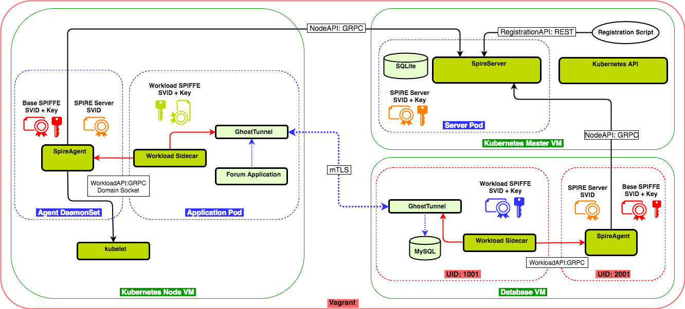

# Kubernetes Workload Attestation Demo

This demo shows two workloads communicating over Ghostunnel authenticated with SVIDs.

One service, a simple bulletin board, is running as a Kubernetes service and is attested by the
spire-agent against the state known by the local kubelet.

The other service is a database running outside of the Kubernetes cluster, attested by its PID.

The spire-agent in the Kubernetes cluster is deployed as a DaemonSet. The spire-server is deployed
as a ReplicationController colocated on the master node. Both run in the kube-system namespace.

Both Ghostunnel processes are managed by the SPIRE Sidecar, which implements calls out to the
Workload API, writing of certificates to the filesystem, and restarting Ghostunnel when necessary.

### Registration Entries

There is also one entry per workload. In both cases there are two selectors: type 'hash' and 'uid',
and the parent is its corresponding node.

| Selectors | SPIFFE ID | PARENT ID |
| :------ | :----- | :----------- |
| unix/uid:1111 | spiffe://example.org/Blog | spiffe://example.org/spiffe/node-id/TokenBlog |  
| unix/uid:1111 | spiffe://example.org/Database | spiffe://example.org/spiffe/node-id/TokenDatabase |  

# Creating the demo

* Start the kubernetes cluster
* Create and register the spire-agent, spire-server containers
* Create and register the application container
* Create the database VM
* Deploy spire-agent and spire-server to the cluster
* Deploy the application to the cluster

# Running the demo

TODO
