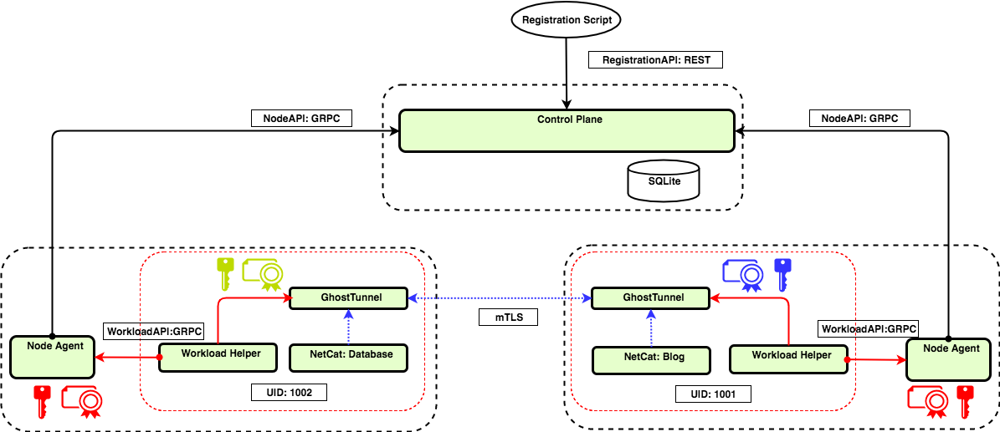

#  Certificate Rotation Demo

This demo shows two workloads communicating over Ghostunnel using generated SVID. A SPIRE deployment takes care of the 
node and workload attestation. After attestation has been established, the Workload sidecar will perform certificate rotation 
for the workload SVIDs at a configured TTL interval.

## Components

This demo is composed of 4 containers: two workloads with their respective SPIRE agents, one SPIRE server and a 
test harness.

### Workload Containers

Two containers use [Ghostunnel](https://github.com/spiffe/ghostunnel) to establish a channel between 
themselves.

Ghostunnel uses [Go SPIFFE library](https://github.com/spiffe/go-spiffe) to parse and verify the SAN URI SPIFFE value.

In each of these containers there is a [Spire Agent](https://github.com/spiffe/sri/cmd/spire-agent) and a [Workload Sidecar](https://github.com/spiffe/spiffe-example/rosemary/build/tools/sidecar).

### Spire Server Container

One container has a [Spire Server](https://github.com/spiffe/sri/cmd/spire-server) with a SQLite data store database.

### Diagram

### Registration Entries

#### Nodes registration entries

There is one entry per node. In both cases there is a single selector of type 'Token', and the parent is the Control Plane.

| Selectors | SPIFFE ID | PARENT ID |
| :------ | :----- | :----------- |
| Token/TokenBlog  |  spiffe://dev.rexsco.com/spiffe/node-id/TokenBlog | spiffe://dev.rexsco.com/spiffe/cp |  
| Token/TokenDatabase | spiffe://dev.rexsco.com/spiffe/node-id/TokenDatabase | spiffe://dev.rexsco.com/spiffe/cp |  

#### Workloads registration entries

There is also one entry per workload. In both cases there are two selectors: type 'hash' and 'uid', and the parent is its corresponding node.

| Selectors | SPIFFE ID | PARENT ID |
| :------ | :----- | :----------- |
| hash/hashstring, uid/1001  | spiffe://dev.rexsco.com/Blog  | spiffe://dev.rexsco.com/spiffe/node-id/TokenBlog |  
| hash/hashstring, uid/1001  | spiffe://dev.rexsco.com/Database   | spiffe://dev.rexsco.com/spiffe/node-id/TokenDatabase |  

## Details

These are the steps performed by the demo:

1. Setup Trust Domain for SPIRE server
- Intermediate cert for SPIRE server
- Self signed root 
2. Setup Spire Agent for Database and Blog workloads
- Seed with SPIRE server trust bundle
- Seed with SPIRE server IP 
- Seed with SPIRE SPIFFE ID (if we are using well known Trust Domain, SPIRE Server SPIFFE ID can be derived)
3. Setup DataStore on Spire Server
- Call registration API to insert Workload data. (Using CLI [registration](/build/tools/registration) ) 
4. Bootstrap Workload Sidecar with the SPIRE Agent Workload API destination 
5. Bootstrap SPIRE Agent attestation with join token (have to replicate token into SPIRE Server)
6. Initiate SPIRE Agent Bootstrap and Attestation 
7. Initiate Blog to Database traffic.
8. Rotate workload SVIDs.

### How to Run

These are the steps to run the demo:

1. Clone this repo
2. Change to 'rosemary/' directory and run 'make'
- This will build the containers and it usually takes several minutes
3. Run 'make demo'
- This will open tmuxinator with 7 panes: 3 pairs of daemon and daemon CLI panes (one pair for SPIRE Server
and two pairs for the SPIRE Agents) and one pane for the main console (aka harness)
4. In the daemon CLI consoles you can run commands against the corresponding daemon
- The daemon CLI name is 'spire-agent\spire-agent' for SPIRE Agent and 'spire-server\spire-server' for SPIRE server
- There are two commands available: 'plugin-info' to list the loaded plugins, and 'stop' to stop the daemon
- For example, to stop the Control Plane daemon you need to run './spire-server stop'
5. In the main/harness console you can run the registration process
- Change to '/root/' and run './registration'
6. To exit tmuxinator press 'Ctrl+B' then '&' and confirm with 'Y'
7. To stop the containers run 'make clean'